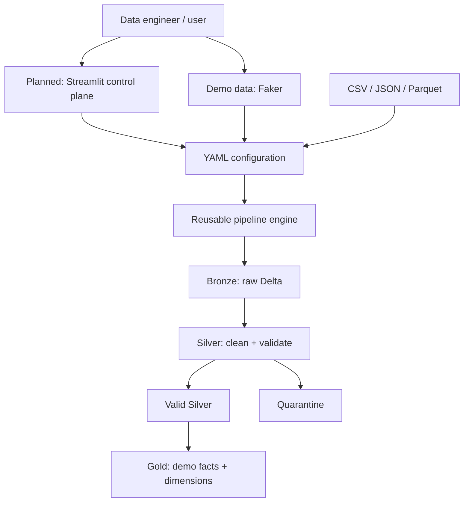

# Lakehouse Data Platform

> **Config-Driven Self-Service Data Engineering Platform**

## Business problem

Data teams receive datasets from many users and systems in incompatible formats.
Maintaining one-off ETL jobs for each dataset duplicates code, makes quality
rules inconsistent, and slows onboarding. This project demonstrates a small,
local self-service platform: one reusable pipeline engine, with behavior
defined through dataset configuration.

## Objective

The platform supports a built-in e-commerce demo and a bring-your-own-data
configuration path for CSV, JSON, and Parquet sources. A future Streamlit
control plane will create and submit those configurations; it will not contain
Spark transformations. The pipeline remains runnable through the CLI.

## Architecture



## Implementation status

### Implemented

- YAML settings and dataset contracts with project-relative paths.
- Deterministic Faker e-commerce demo data: customers, products, orders,
  order items, and payments.
- Config-driven CSV, JSON, and Parquet ingestion interface.
- Delta Bronze writer with ingestion metadata.
- Silver cleanup, quality validation, and quarantine outputs.
- CLI pipeline engine independent of any UI.
- Automated unit tests for configuration, generation, ingestion validation,
  and quality-rule metadata.

### Planned

- Incremental Delta MERGE and SCD Type 2.
- Streamlit self-service control plane and execution monitoring.
- Pipeline metadata store, PostgreSQL serving, Airflow, Docker, and CI.

## Run the demo

```bash
python3 -m venv .venv
source .venv/bin/activate
pip install -r requirements.txt
python -m src.generators.generate_demo_data
python run_pipeline.py --mode demo --stage bronze
python run_pipeline.py --mode demo --stage silver
python run_pipeline.py --mode demo --stage gold
python -m src.generators.generate_incremental_data
```

PySpark requires a local Java runtime; JDK 17 is recommended. The current
implementation requires `pyspark` and `delta-spark` from `requirements.txt` to
execute Bronze and Silver.

## Bring your own data

The pipeline accepts either the current dataset registry or an individual
dataset YAML file. The self-service-oriented contract lives at
[`config/datasets/customers.yaml`](config/datasets/customers.yaml):

```bash
python run_pipeline.py --mode user --config config/datasets/customers.yaml --stage bronze
```

The `dataset.name` structure is normalized by the configuration loader before
reaching the reusable pipeline engine, keeping future UI concerns separate.

## Technology stack

- **Python, PySpark, Delta Lake** — reusable local pipeline engine and lakehouse layers.
- **YAML** — source metadata, validation choices, and processing behavior.
- **Faker** — demo data only, deliberately separate from processing.
- **Delta MERGE** — configuration-driven idempotent Bronze upserts when incremental loading is enabled.
- **Pytest** — repeatable unit tests.
- **Planned:** Streamlit, PostgreSQL, Airflow, Docker, and GitHub Actions.
- **Streamlit control plane:** initial upload/configuration experience is available via `streamlit run app/Home.py`.

## Repository structure

```text
app/                 Future control-plane boundary; no pipeline transforms
config/              Global settings, registry, and self-service contracts
data/                Local-only demo, input, medallion, quarantine, metadata zones
src/                 Reusable pipeline engine
tests/               Automated tests
docs/                Architecture and implementation documentation
orchestration/       Reserved for later DAGs
sql/                 Reusable Gold analytics SQL
```

## Roadmap

1. Foundation and configuration architecture
2. Demo data generator
3. Generic ingestion and Bronze
4. Silver, data quality, and quarantine
5. Gold dimensional model and Spark SQL (implemented for demo mode)
6. Incremental processing and SCD Type 2
7. Streamlit control plane
8. Metadata, monitoring, and PostgreSQL
9. Airflow, Docker, tests, and CI
10. End-to-end validation and portfolio polish

## Verification

```bash
python3 -m pytest -q
```

Expected output:

```text
16 passed
```
