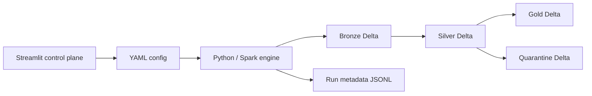

# Architecture

The platform separates a future Streamlit control plane from the reusable CLI
pipeline engine. Sources enter Bronze as Delta, flow through Silver validation
and quarantine, then the demo e-commerce model builds Gold dimensions and facts.

The UI writes configuration and delegates execution to the same CLI; it does
not contain Spark transformations.
